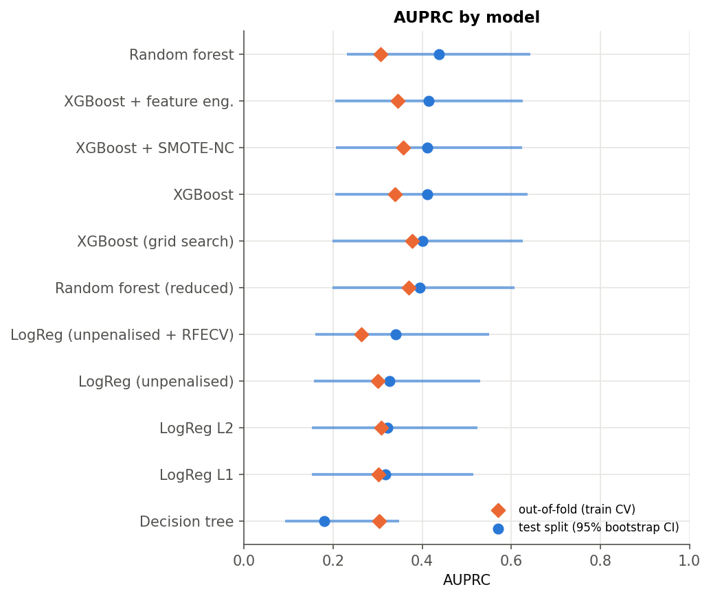
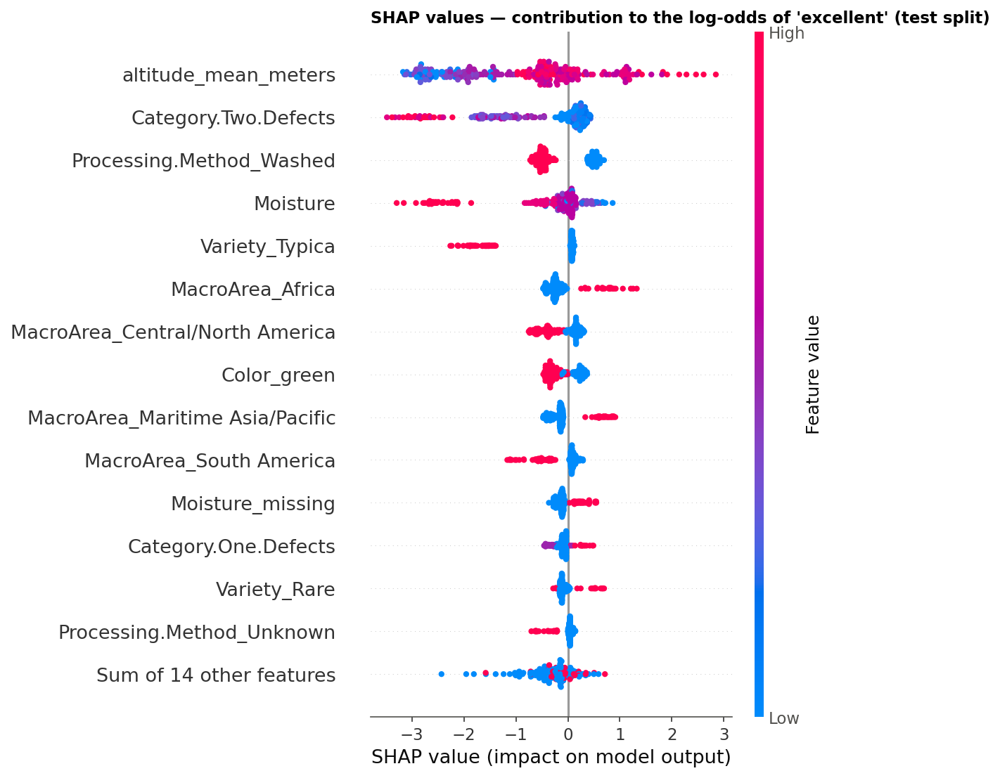
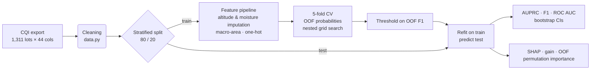

# Arabica Quality Prediction


> Course project for **Applied Statistics** - MSc in Computer Science and Engineering (AI track), Politecnico di Milano, 2026.
> Team project *"Guardiani della Gaussiana"*

**Can you predict elite coffee before anyone tastes it?**
1,311 Arabica lots graded by the Coffee Quality Institute, of which only **8 % score ≥ 85 points** ("excellent": 106 lots in the raw data, 103 of 1,240 after cleaning). Using nothing but information available before cupping - altitude, origin, variety, processing method, bean colour, moisture and defect counts - we compare logistic regression, XGBoost and random forests under a leakage-free evaluation protocol, explain the models with SHAP and permutation importance, and show why the sensory scores that *look* like the best predictors cannot be used at all.

## 🚀 Overview

The project runs on two tracks that share the same cleaned data:

| Track | Predictors | Available | Best test AUPRC | What it answers |
|---|---|---|---|---|
| **Agronomic** (main) | altitude, macro-origin, variety, processing, colour, moisture, defects | before cupping | **0.44** (random: 0.08) | can excellence be *screened* early? |
| **Sensory** | aroma, flavour, aftertaste, acidity, body, balance | after cupping | 0.93 | which cup attributes *define* excellence? (target leakage by construction) |

### Key findings

1. **The agronomic signal is real but weak.** Every model beats the random baseline (AUPRC 0.08) by a factor of 4–5, but the best ensembles plateau at AUPRC ≈ 0.40-0.44 and F1 ≈ 0.35 on the test split, retrieving 3-4 excellent lots out of 10 at ~40 % precision. Good enough to prioritise cupping slots, not to replace the cup.
2. **Altitude, secondary defects, moisture, processing method and macro-origin carry the signal**, in the direction agronomy predicts: higher, cleaner, drier lots from East Africa score better. Coefficients, SHAP values and permutation importance agree.
3. **No model family wins.** With 21 positives in the test split, bootstrap intervals on AUPRC are ±0.2 wide; random forest, XGBoost, XGBoost + feature engineering and XGBoost + SMOTE-NC are statistically indistinguishable, and all beat the logistic regressions by a small margin (interactions matter).
4. **The data hides proxies.** `Moisture == 0` is not a measurement but a "not measured" code used by a few certifying labs that also grade a disproportionate share of excellent lots; the strong "moisture effect" highlighted by SHAP in the original analysis was partly this artefact. It is now recoded as missing and modelled with an explicit indicator.
5. **Three kinds of leakage were found and removed** during the project — pre-processing leakage (imputation and rare-category pooling fitted on the whole dataset), validation leakage (SMOTE before cross-validation, thresholds and feature selection tuned on the test labels) and target leakage (sensory scores are components of the target). Each one is reproduced on purpose in the notebooks to show its size: tuning the threshold on the test set alone inflates F1 by ≈ +0.10; naive SMOTE reports F1 = 0.97 on the resampled training set and 0.38 on the test set. See [`docs/LESSONS_LEARNED.md`](docs/LESSONS_LEARNED.md).

### Model comparison (test split, 248 lots / 21 excellent)

| Model | AUPRC [95 % CI] | F1 [95 % CI] | ROC AUC | Out-of-fold AUPRC |
|---|---|---|---|---|
| Logistic regression (unpenalised) | 0.33 [0.16, 0.53] | 0.40 [0.19, 0.58] | 0.74 | 0.30 |
| Logistic regression L1 / L2 | 0.32 / 0.32 | 0.32 / 0.35 | 0.77 / 0.75 | 0.30 / 0.31 |
| XGBoost | 0.41 [0.20, 0.64] | 0.34 [0.16, 0.51] | 0.78 | 0.34 |
| XGBoost + feature engineering | 0.42 [0.20, 0.63] | 0.35 [0.15, 0.54] | 0.79 | 0.35 |
| XGBoost + SMOTE-NC (in-fold) | 0.41 [0.21, 0.62] | 0.33 [0.16, 0.48] | 0.72 | 0.36 |
| Random forest | **0.44** [0.23, 0.64] | 0.33 [0.12, 0.52] | 0.81 | 0.31 |
| Random forest (reduced, OOF permutation importance) | 0.39 [0.20, 0.61] | 0.35 [0.14, 0.54] | **0.82** | **0.37** |

Thresholds are chosen on out-of-fold training predictions (F1-optimal); the test labels are never used for any decision. Full table with precision/recall in [`reports/metrics/model_comparison.csv`](reports/metrics/model_comparison.csv), discussion in [`docs/RESULTS.md`](docs/RESULTS.md).

<p align="center">
  
  
</p>

## 🧠 Pipeline



Every learned transformation (altitude means, moisture median, rare-variety pooling, scaling, one-hot encoding, SMOTE-NC) is a scikit-learn / imbalanced-learn pipeline step, so it is fitted **inside** each cross-validation fold and never sees validation or test rows.

## 🛠️ Tech stack

* **Data:** [pandas](https://pandas.pydata.org/), [NumPy](https://numpy.org/)
* **Models & evaluation:** [scikit-learn](https://scikit-learn.org/) (pipelines, nested CV, RFECV, random forest), [XGBoost](https://xgboost.readthedocs.io/), [imbalanced-learn](https://imbalanced-learn.org/) (SMOTE-NC), [statsmodels](https://www.statsmodels.org/) (GLM inference & diagnostics)
* **Interpretation:** [SHAP](https://shap.readthedocs.io/), permutation importance
* **Unsupervised:** PCA, t-SNE, k-means, hierarchical clustering, DBSCAN
* **Quality:** [pytest](https://pytest.org/), [ruff](https://docs.astral.sh/ruff/), GitHub Actions

## 📖 Documentation

* [Methodology](docs/METHODOLOGY.md) — data cleaning rules, feature pipeline, evaluation protocol, every model's configuration
* [Results](docs/RESULTS.md) — all numbers with confidence intervals, figures, and what they mean
* [Lessons learned](docs/LESSONS_LEARNED.md) — the three leakages, how they were found, how much they were worth
* [Data](data/README.md) — provenance, licence and column dictionary

### Notebooks (executed, read them on GitHub)

| # | Notebook | Content |
|---|---|---|
| 01 | [Data cleaning and EDA](notebooks/01_data_cleaning_and_eda.ipynb) | cleaning rules, target definition, class imbalance, what moves with excellence |
| 02 | [Unsupervised structure](notebooks/02_unsupervised_structure.ipynb) | PCA, t-SNE, k-means, hierarchical, DBSCAN — one continuous cloud along the altitude axis |
| 03 | [Agronomic models](notebooks/03_agronomic_models.ipynb) | logistic regression (4 variants), XGBoost (3 variants), SMOTE-NC, decision tree, random forest; leakage demos |
| 04 | [Interpretability](notebooks/04_interpretability.ipynb) | GLM inference and diagnostics, gain vs split count, SHAP, out-of-fold permutation importance |
| 05 | [Sensory track](notebooks/05_sensory_track.ipynb) | the sensory paradox; ranking of the cupping dimensions |

## 🚦 Getting started

### Prerequisites

* Python 3.10 or higher
* No API keys, no downloads: the dataset (650 KB) is versioned in `data/raw/`

### Installation

```bash
git clone https://github.com/DeveloperMatt02/arabica-quality-prediction.git
cd arabica-quality-prediction
python -m venv .venv && source .venv/bin/activate   # Windows: .venv\Scripts\activate
pip install -e ".[notebooks,dev]"
```

### Reproduce everything

```bash
python scripts/run_pipeline.py            # ~6 min on 2 cores: all metrics and figures in reports/
python scripts/run_pipeline.py --quick    # ~3 min: fewer bootstrap draws, no XGBoost grid search
python scripts/run_pipeline.py --stage models --stage interpret   # a subset of stages
pytest                                    # 22 unit tests (cleaning, transformers, protocol)
jupyter lab notebooks/                    # the narrative
```

All random seeds are fixed (`coffee_quality/config.py`); re-running reproduces the tables in `reports/metrics/` to the last digit on the same library versions.

### Use the package

```python
from coffee_quality import data, evaluation
from coffee_quality.models import boosting

df = data.load_clean()                       # cleaned lots with the Excellent target
X, y = data.make_model_matrix(df)            # raw agronomic predictors (imputation happens in the pipeline)
X_tr, X_te, y_tr, y_te = data.stratified_split(X, y)

n_trees, _ = boosting.freeze_n_estimators(X_tr, y_tr)             # early stopping inside CV folds
model = boosting.build_smotenc_xgboost(n_trees)                    # SMOTE-NC → one-hot → XGBoost
result = evaluation.evaluate("XGB + SMOTE-NC", model, X_tr, y_tr, X_te, y_te)
print(result.metrics, result.threshold, result.ci["auprc"])
```

## 📂 Project structure

```text
arabica-quality-prediction/
├── coffee_quality/              # the Python package
│   ├── config.py                #   paths, seed, column groups, macro-area map, excellence rule
│   ├── data.py                  #   loading, deterministic cleaning, target, split
│   ├── features.py              #   RegionAltitudeImputer, MoistureImputer, MacroAreaMapper, feature engineering
│   ├── preprocessing.py         #   the single feature pipeline shared by every model
│   ├── evaluation.py            #   OOF → threshold → test protocol, metrics, bootstrap CIs, leakage demo
│   ├── interpret.py             #   SHAP, XGBoost gain/weight, out-of-fold permutation importance
│   ├── unsupervised.py          #   PCA, t-SNE, k-means, hierarchical, DBSCAN
│   ├── sensory.py               #   the sensory track
│   ├── eda.py · plotting.py     #   tables and figures
│   └── models/                  #   logistic.py · boosting.py · forest.py
├── scripts/
│   ├── run_pipeline.py          # regenerates reports/ end to end
│   └── geocode_regions.py       # built data/raw/extracted_coords.csv (needs network, run once)
├── notebooks/                   # 01 … 05, executed
├── tests/                       # pytest suite
├── data/raw/                    # CQI export + region coordinates
├── reports/figures · metrics/   # every figure and table quoted in the docs
├── docs/                        # METHODOLOGY · RESULTS · LESSONS_LEARNED
├── pyproject.toml · requirements.txt · .env.example · LICENSE
└── .github/workflows/tests.yml  # ruff + pytest on Python 3.10 and 3.12
```

## 👥 Team

The analysis was carried out as a group project. This repository is the refactored, reproducible version of the team's work.

* **Matteo Trossi** — [GitHub](https://github.com/DeveloperMatt02) · [LinkedIn](https://linkedin.com/in/matteotrossi)
* *(teammates — to be added)*

## 📄 License

This project is licensed under the MIT License — see [LICENSE](LICENSE). The CQI data are published for public use; see [`data/README.md`](data/README.md).
