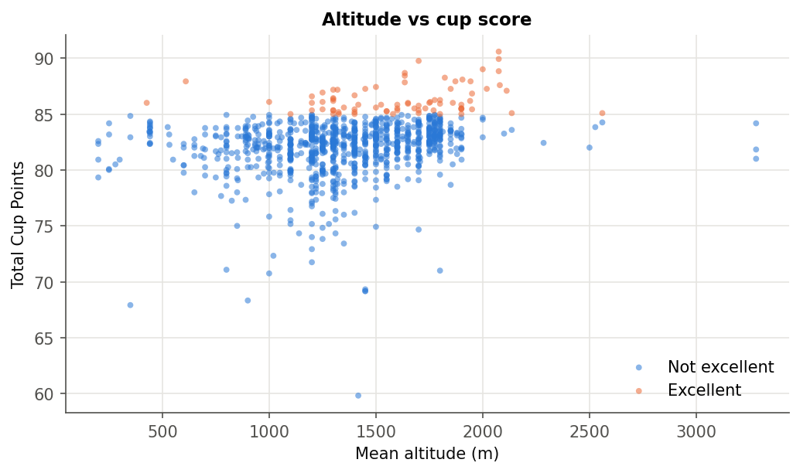
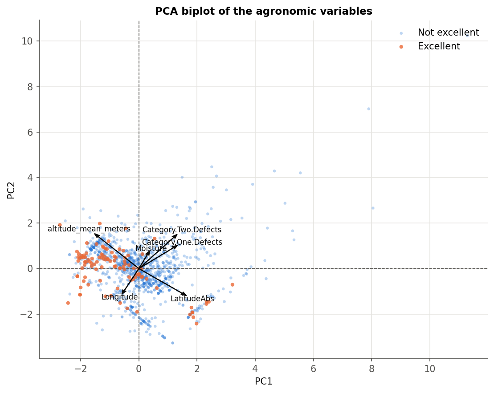
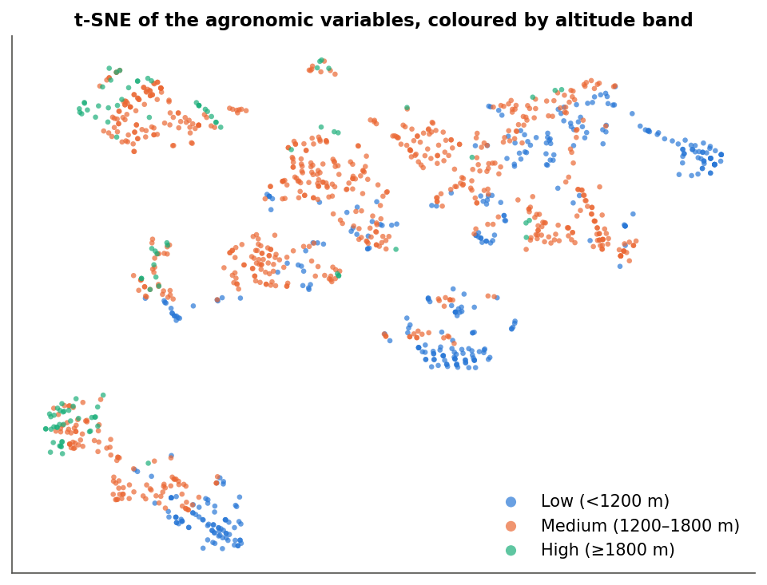
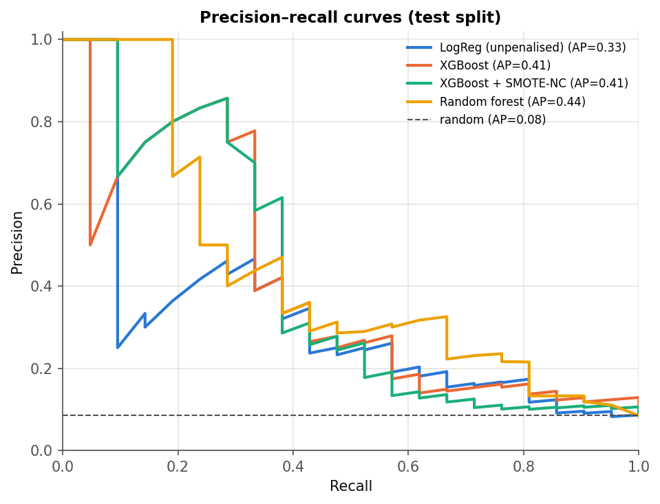
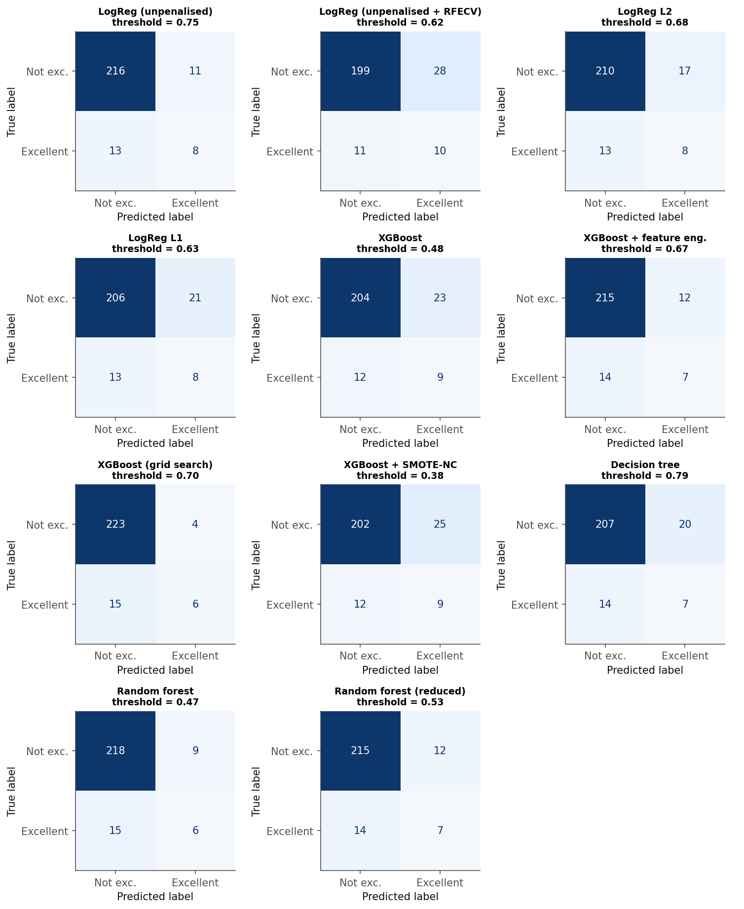

# Results

All numbers come from `python scripts/run_pipeline.py` (seed 42) and are stored in `reports/metrics/`; every figure is in `reports/figures/`. Method details are in [METHODOLOGY.md](METHODOLOGY.md).

---

## Table of contents

1. [The data after cleaning](#1-the-data-after-cleaning)
2. [Exploratory findings](#2-exploratory-findings)
3. [Unsupervised structure](#3-unsupervised-structure)
4. [Agronomic models](#4-agronomic-models)
5. [What drives the predictions](#5-what-drives-the-predictions)
6. [Sensory track](#6-sensory-track)
7. [Conclusions and limitations](#7-conclusions-and-limitations)

---

## 1. The data after cleaning

| | Lots | Excellent | Rate |
|---|---|---|---|
| raw export | 1,311 | 106 | 8.1 % |
| after cleaning | 1,240 | 103 | 8.3 % |
| training split | 992 | 82 | 8.3 % |
| test split | 248 | 21 | 8.5 % |

Missing before the pipeline: altitude 225 rows (18 %), moisture 229 rows (18 %, the `0` code), region 55 rows.

## 2. Exploratory findings

Mann–Whitney tests between classes (`reports/metrics/eda_mann_whitney.csv`):

| Variable | Median, not excellent | Median, excellent | p-value |
|---|---|---|---|
| altitude (m) | 1,311 | 1,635 | 6 × 10⁻¹¹ |
| moisture | 0.11 | 0.10 | 1 × 10⁻⁶ |
| category-two defects | 2 | 1 | 0.01 |
| category-one defects | 0 | 0 | 0.24 |

Excellence rate by processing method: Unknown 16 %, Natural 12 %, Semi-washed 11 %, Honey 8 %, Washed 6 %. By country (n ≥ 10): Ethiopia 57 %, Kenya 29 %, Uganda 27 %, Peru 20 %, then everything else below 15 %; Mexico (the largest origin, 234 lots) 1.3 %. The `Unknown` processing and variety levels are mostly Ethiopian lots with incomplete metadata — *missing* is informative in this dataset.

## 3. Unsupervised structure

 

* PCA: PC1 explains 27 % of the variance, PC2 22 %, PC3 17 %; four components are needed for 80 %. PC1 opposes altitude to defects and distance from the equator; PC3 is essentially moisture.
* k-means silhouettes stay between 0.19 and 0.36 for k = 2…6 (`kmeans_silhouette.csv`), with no elbow.
* DBSCAN returns a single cluster for every ε (0.75–1.5) and only the noise count changes.
* Dendrograms show the chaining typical of a continuous cloud.

**Reading:** the agronomic variables describe one continuous population organised along altitude, not a set of coffee "types". Clustering neither reveals hidden groups nor helps the classifiers.

## 4. Agronomic models

Test split: 248 lots, 21 excellent; random-baseline AUPRC = 0.085. Thresholds chosen on out-of-fold training predictions (F1-optimal). 95 % bootstrap intervals in brackets.

| Model | Threshold | Precision | Recall | F1 | ROC AUC | **AUPRC** | OOF AUPRC |
|---|---|---|---|---|---|---|---|
| LogReg (unpenalised) | 0.75 | 0.42 | 0.38 | 0.40 [0.19, 0.58] | 0.74 | 0.33 [0.16, 0.53] | 0.30 |
| LogReg (unpenalised + RFECV) | 0.62 | 0.26 | 0.48 | 0.34 [0.18, 0.49] | 0.74 | 0.34 [0.16, 0.55] | 0.26 |
| LogReg L2 | 0.68 | 0.32 | 0.38 | 0.35 [0.16, 0.51] | 0.75 | 0.32 [0.15, 0.52] | 0.31 |
| LogReg L1 | 0.63 | 0.28 | 0.38 | 0.32 [0.15, 0.47] | 0.77 | 0.32 [0.15, 0.52] | 0.30 |
| XGBoost | 0.48 | 0.28 | 0.43 | 0.34 [0.16, 0.51] | 0.78 | 0.41 [0.20, 0.64] | 0.34 |
| XGBoost + feature eng. | 0.67 | 0.37 | 0.33 | 0.35 [0.15, 0.54] | 0.79 | 0.42 [0.20, 0.63] | 0.35 |
| XGBoost (grid search) | 0.70 | 0.60 | 0.29 | 0.39 [0.15, 0.60] | 0.77 | 0.40 [0.20, 0.63] | 0.38 |
| XGBoost + SMOTE-NC | 0.38 | 0.27 | 0.43 | 0.33 [0.16, 0.48] | 0.72 | 0.41 [0.21, 0.62] | 0.36 |
| Decision tree | 0.79 | 0.26 | 0.33 | 0.29 [0.11, 0.45] | 0.69 | 0.18 [0.09, 0.35] | 0.30 |
| Random forest | 0.47 | 0.40 | 0.29 | 0.33 [0.12, 0.52] | 0.81 | **0.44** [0.23, 0.64] | 0.31 |
| Random forest (reduced) | 0.53 | 0.37 | 0.33 | 0.35 [0.14, 0.54] | **0.82** | 0.39 [0.20, 0.61] | **0.37** |

 

What the table says:

* **Signal, yes.** Every model except the single decision tree quadruples the random AUPRC; ROC AUCs of 0.74–0.82 mean that a randomly chosen excellent lot is ranked above a random ordinary lot three times out of four.
* **Ensembles > linear, slightly.** Random forest and the XGBoost family cluster at AUPRC 0.40–0.44 on the test split and 0.34–0.38 out-of-fold; the logistic regressions at 0.32–0.34 / 0.26–0.31. Interactions between altitude, origin, processing and moisture add roughly 0.05–0.10 AUPRC over a linear logit.
* **No winner among the ensembles.** The bootstrap intervals are ±0.2 wide and overlap almost completely. Feature engineering (+0.004), the grid search (−0.01) and SMOTE-NC (+0.001) move the point estimate within the noise; SMOTE-NC does improve the out-of-fold AUPRC (0.36 vs 0.34) at the cost of ROC AUC.
* **Operating point.** At the F1-optimal threshold the models flag 15–30 lots out of 248 and catch 6–10 of the 21 excellent ones. As a screening rule — "cup these first" — that triples the hit rate of a random pick; as a substitute for cupping it is not usable.
* **The reduced random forest** (15 of 27 encoded columns kept) has the best out-of-fold AUPRC and ROC AUC but a lower test AUPRC — one more reminder that with 21 positives a ±0.05 difference is not a difference.

Leakage demonstrations on the same models (`leakage_threshold_on_test.csv`, `leakage_naive_smote.csv`):

| Shortcut | Reported | Honest |
|---|---|---|
| random forest, threshold tuned on the **test labels** | F1 = 0.44 | F1 = 0.33 (same AUPRC 0.44 — it is threshold-free) |
| plain SMOTE on the whole training set, threshold on the **resampled** train predictions | F1 = 0.97, AUPRC = 0.997 (training) | F1 = 0.38, AUPRC = 0.40 (test) |

## 5. What drives the predictions

Mean |SHAP| on the test split (XGBoost): altitude 1.25 · category-two defects 0.76 · washed processing 0.50 · moisture 0.50 · Typica variety 0.38 · African origin 0.30 · Central/North-American origin 0.30. Directions: higher altitude ↑, more secondary defects ↓, higher moisture ↓, washed ↓, natural/unknown processing ↑, Typica ↓, Africa and Maritime Asia/Pacific ↑, South America ↓.

Out-of-fold permutation importance of the random forest, aggregated by raw variable (AUPRC drop): altitude 0.15 · macro-area 0.08 · processing method 0.07 · moisture 0.03 · category-two defects 0.02 · moisture-missing flag 0.02 · colour 0.02 · variety 0.01 · category-one defects ≈ 0.

Unpenalised logistic regression (GLM, `logreg_glm_summary.txt`): per standard deviation, altitude +0.76 log-odds (p < 10⁻⁹), category-two defects −0.61 (p < 10⁻⁴), moisture −0.30 (p = 0.003); natural (+1.48) and semi-washed (+1.68) processing, African (+1.09) and Maritime Asia/Pacific (+1.00) origin significant and positive; South America (−0.60) and Typica (−1.43) significant and negative; the moisture-missing flag +0.33 (p < 10⁻³). Deviance residuals are flat in every numeric predictor (no transformation needed); the most influential points are excellent lots with ordinary profiles, not errors.

XGBoost gain vs split count: gain is led by categorical dummies (Africa, washed, moisture-missing, green colour, Typica), split count by altitude (2,927 splits) and category-two defects (1,206) — the trees keep subdividing the continuous variables, a mild overfitting signature. Under SMOTE-NC the gain of the "lab signature" dummies (washed, moisture-missing, green) collapses by 70–80 % while African origin gains: oversampling shifts the model toward agronomically plausible variables without improving its accuracy.

## 6. Sensory track

Six cupping attributes (aroma, flavour, aftertaste, acidity, body, balance), stratified 75/25 split.

| Model | Precision | Recall | F1 | ROC AUC | AUPRC |
|---|---|---|---|---|---|
| Logistic regression (test) | 0.72 | 1.00 | 0.84 | 0.996 | 0.93 |
| Random forest (test) | 0.86 | 0.92 | 0.89 | 0.994 | 0.90 |
| Logistic regression (5-fold CV) | | | 0.84 ± 0.07 | 0.995 ± 0.004 | 0.94 ± 0.05 |

These numbers are the **sensory paradox**: near-perfect separation because the predictors are the components of the target. They are not comparable with §4 and cannot be used before cupping.

Combined ranking of the attributes (`sensory_feature_ranking.csv`, average of scaled logit coefficient, lasso coefficient, Gini and out-of-fold permutation importance):

| Rank | Attribute | Logit coef / SD | Odds ratio / SD | Permutation AUPRC drop | Score |
|---|---|---|---|---|---|
| 1 | Flavor | 2.25 | 9.5 | 0.16 | 0.97 |
| 2 | Aftertaste | 2.39 | 10.9 | 0.07 | 0.54 |
| 3 | Balance | 1.66 | 5.3 | 0.15 | 0.51 |
| 4 | Acidity | 1.69 | 5.4 | 0.10 | 0.34 |
| 5 | Body | 1.38 | 4.0 | 0.04 | 0.06 |
| 6 | Aroma | 1.38 | 4.0 | 0.02 | 0.00 |

All six coefficients are significant (p ≤ 0.003); pairwise correlations between attributes range from 0.56 to 0.86, so individual coefficients are unstable and the combined ranking is the robust statement: **flavour first, then aftertaste / balance / acidity, with body and aroma adding little once the others are known.**

## 7. Conclusions and limitations

1. Pre-harvest data allow a **screening**, not a verdict: AUPRC ≈ 0.4 against a 0.08 baseline, with altitude, secondary defects, moisture, processing and macro-origin as the drivers.
2. The **class imbalance is not the bottleneck** — SMOTE-NC, class weights and threshold tuning all land in the same place. What is missing is *resolution*: soil, micro-climate, harvest timing and post-harvest handling are not in the data, and two lots that look identical on every recorded variable can differ by ten cup points.
3. **Small positives dominate the uncertainty.** 21 test positives give ±0.2 AUPRC intervals; the out-of-fold estimates (82 positives) are the more reliable ranking, and they favour the tuned XGBoost / reduced random forest by a hair.
4. **Data artefacts matter more than model choice** here: the `Moisture == 0` code and the informative missingness of processing/variety are lab signatures that a careless pipeline turns into leakage.
5. The **sensory scores define the target**; their apparent predictive power is circular. The only legitimate use is the ranking of attributes, which puts flavour and aftertaste at the top.

Possible extensions: repeated (e.g. 10 × 5-fold) cross-validation on the whole dataset to shrink the intervals; calibrated probabilities and a cost-sensitive operating point tied to cupping capacity; external agro-climatic covariates (rainfall, temperature) joined on region; a regression on `Total.Cup.Points` instead of a hard threshold at 85.
